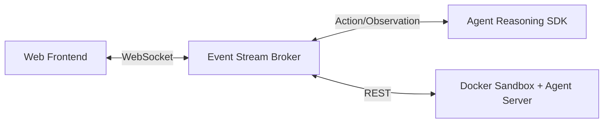

# 2026 业界主流 Web Coding/Dev Agent 平台的多租户架构与执行沙箱最佳实践

**领域**: AI Agent 架构, 云原生基础设施, 容器隔离与安全  
**调研方式**: 一手资料查证 (Primary Sources: 官方文档, 架构设计图, GitHub 开源代码仓库)

---

## 1. 行业标杆产品的多租户架构与沙箱设计

随着 Devin 的出圈，行业内涌现出大量构建 Dev/Coding Agent 平台的解决方案。从完全云端的 Firecracker 隔离，到开源的 Docker 架构，再到浏览器端的 WebContainers，不同产品的架构取舍直接决定了它们的能力边界与安全性。

### 1.1 Devin (Cognition AI) 的架构与 Firecracker 沙箱
Devin 的系统设计最显著的特点是**逻辑引擎与执行沙箱的强解耦**。

*   **架构解耦**: Cognition 将 Devin 拆分为无状态的推理引擎 (**The Brain**，存在于 Cognition Cloud) 和完全隔离、有状态的执行工作区 (**Devbox/Outposts**) [^1][^4]。
*   **底层隔离技术 (Firecracker microVMs)**: 针对多租户安全，Devbox 放弃了传统的 Linux Namespace (如 Docker)，转而采用基于 KVM 的 Firecracker 微型虚拟机。Firecracker 能够为每个沙箱提供极简的、完全独立的 Linux 内核，有效抵御内核态提权与逃逸攻击 [^2]。
*   **沙箱内部协同**: Devbox 内部运行了一套紧密集成的工具链，包含 Headless Browser (供 Devin 浏览网页与文档)、Shell 终端、Editor 后端服务以及文件系统监控器。Brain 通过远程过程调用（RPC）向 Devbox 发送指令（写文件、执行 bash），并读取执行流（stdout/stderr）。
*   **快照与预热**: 借助 Firecracker 的 Snapshot 机制，Devbox 实现了环境的极速冷启动，通过预先加载操作系统状态来消除传统虚机的引导延迟。

### 1.2 OpenHands (原 OpenDevin) 的 All-Hands Runtime 与 Event Stream
OpenHands 是目前最活跃的开源 Dev Agent 实现，其核心架构围绕**事件驱动**展开 [^5][^6]。

*   **Event Stream 架构**: 系统的中枢是一条 Event Stream（事件流消息总线）。Frontend 界面、Agent Reasoning SDK 和底层 Runtime 全部通过产生和消费 Action（动作）与 Observation（观察结果）来进行异步协同，实现了 Agent 逻辑与执行环境的解耦 [^5]。
*   **V1 Runtime 演进**: 在早期的 V0 架构中，通信依赖脆弱的 SSH。V1 演进为 `All-Hands` 架构：在 Docker Runtime 沙箱内常驻一个 Agent Server，外部框架通过 REST API 或 Event Stream 直接与沙箱内的 Agent Server 交互。这种设计允许无缝替换底层沙箱（支持任意自定义的 Docker 镜像） [^7]。

### 1.3 Bolt.new (StackBlitz) 与 WebContainers 的致命缺陷
Bolt.new 提供了一种极致的“零延迟”体验，其核心是基于 WebAssembly 的 **WebContainers** 技术，将 Node.js 环境直接搬到了浏览器的沙箱中执行 [^8]。

*   **执行方案**: 整个应用构建、依赖安装 (npm) 和 dev server 全部在用户的浏览器 Tab 内存中运行，无需云端分配沙箱计算资源。
*   **能力边界与致命缺陷**: 
    1.  **无法运行底层/Native 二进制**: 任何需要依赖 C/C++ 编译的底层库如果未被编译为 WASM，则完全无法运行。
    2.  **复杂语言栈受限**: 对 Python 的支持仅限于实验性的纯 Python 环境，缺乏完整的 `pip` 体系和 C 扩展生态系统，不适用于复杂的后端或 AI 依赖栈 [^8]。
    3.  **缺乏持久性与后台任务**: 沙箱的生命周期与浏览器 Tab 绑定。Tab 一旦关闭，服务即刻终止，无法作为需要持久运行、依赖 Redis/PostgreSQL 等中间件的复杂 Web Agent 后端架构。

### 1.4 E2B 与 Daytona: 当代 AI 工作区的基础设施首选
针对自研沙箱的高昂成本，大量 Web Agent 平台选择基于 E2B 或 Daytona 的基础设施。

*   **E2B 架构 (Firecracker + UFFD)** [^9]: 
    *   E2B 为每个沙箱分配独立的 Firecracker microVM。为了实现毫秒级启动，E2B 使用了预热模板快照 (Pre-booted snapshots)，并结合 **`userfaultfd` (UFFD) 内存懒加载技术**：仅在虚拟机实际访问特定内存页时，才从磁盘按需加载，从而实现海量沙箱的极致并发启动效率。
    *   沙箱内部运行 `envd` 守护进程，对外暴露 gRPC 接口供 Orchestrator 进行沙箱全生命周期的 RPC 调用 [^9]。
*   **Daytona 开源工作区管理器** [^10]:
    *   Daytona 提供了标准化隔离环境的开源编排。采用三面架构：Interface Plane (CLI/Web), Control Plane (基于 NestJS 的控制平面，负责鉴权与状态), Compute Plane (运行沙箱的 Runner 节点)。
    *   每个容器内注入了 `Daytona daemon`，直接提供代码执行、LSP（Language Server Protocol）支持、终端会话的 API 暴露，天然适合作为 AI Agent 的“数字身体”。

---

## 2. 多租户 Web Agent 的核心痛点与演进最佳实践

要落地生产级别的多租户 Coding Agent 平台，在安全、资源调度与持久化层面需要遵循以下最佳实践：

### 2.1 安全与网络隔离 (防逃逸与内网保护)
对于多租户平台执行 AI 生成的不可信代码，**普通的 Docker 容器 (Linux Namespace) 绝对不足够**。
*   **隔离级别**: 推荐使用 Firecracker/KVM 提供轻量级硬件虚拟化，每个租户获得独立的 Guest Kernel，阻断提权攻击。如果必须使用容器，则必须配置为 Rootless 模式并使用 gVisor (如 Google Cloud Run 所用) 拦截 Syscall。
*   **Egress Firewall (内网流量过滤)**: 必须在网卡层或 eBPF 层面配置严格的出站（Egress）防火墙。AI 生成的代码（可能受到用户的 Prompt Injection 攻击）极易试图探测宿主机云厂商的元数据 API (如 AWS `169.254.169.254`) 来窃取云凭证，或向内网数据库发起攻击。必须做到 Default Deny，只放行对公网特定端口 (80/443/依赖仓库) 的访问。

### 2.2 沙箱生命周期与资源调度
AI Agent 的交互具有极强的“突发性”和“长空闲”特征，按需分配资源会导致冷启动过长，一直保持运行则会导致成本失控。
*   **预热池 (Warm Pool)**: 控制面板应始终在后台维护一组已经完成 OS 启动的空白快照实例，当收到 Web 请求时，即时绑定用户 Workspace 目录即可分发。
*   **空闲挂起 (Pause / Snapshot)**: 当 WebSocket 掉线或 Agent 空转超过阈值，控制面板通过 Firecracker Snapshot 将内存状态持久化到 NVMe 盘，并回收 CPU 与内存资源。用户再次激活时毫秒级拉起。
*   **资源限额**: 在 Orchestrator 侧必须配置严苛的 cgroups (限制 vCPU 积分、最大内存上限与 OOM Killer 优先级)，防止恶意死循环 (如 fork 炸弹) 耗尽 Node 节点资源。

### 2.3 数据持久化与解耦隔离
*   **会话数据 vs 执行数据**: 对话上下文 (Chat History, JSONL) 与 Agent 的执行工作区 (File System) 必须解耦。对话存储在可靠的 RDS/MongoDB 中，工作区文件则挂载为存储卷。
*   **存储选型演进**:
    *   *反模式*: 为每个租户创建 K8s PVC（ReadWriteOnce），导致沙箱 Pod 被死锁在特定的 Node 节点，漂移恢复时间长，且小文件 IO 性能随存储层网络开销剧增。
    *   *最佳实践 (S3 异步同步)*: 沙箱运行在带有本地高速 NVMe 的节点上（提供极致的文件 IO 与 `npm install` 性能）。在沙箱初始化时从 S3/MinIO 下载 Workspace 压缩包，运行期间的增量变化由常驻的 Daemon 在后台静默打包增量上传至 S3。
    *   *最终态真理*: Git Repository 是代码持久化的唯一 Source of Truth，平台最终应当通过 Commit 推送来固化开发成果。

### 2.4 通信与流式协议保障
Web Agent 体验的流畅度高度依赖于终端日志的实时回显和状态同步。
*   网络链路需采用双通道：
    *   **业务控制面**: Web Client ↔ Gateway ↔ Agent Runtime 使用 Server-Sent Events (SSE) (针对单向模型生成) 或 WebSocket (针对双向 Shell 交互)。
    *   **底层执行面**: Gateway ↔ Compute Node (Orchestrator) ↔ VM 内的 `envd` 推荐使用 **gRPC**，利用其自带的多路复用 (Multiplexing) 将 stdout, stderr, process metrics 汇总传输，确保极低延迟并保证动作执行结果的时序一致性。

---

**References & Primary Sources:**
[^1]: [Devin Cloud Outposts Architecture / Sandboxes - Cognition Docs](https://docs.devin.ai)
[^2]: [Cognition Devin AI Architecture - Firecracker & Security](https://fast.io/resources/cognition-devin-ai-architecture/)
[^4]: [Datarekha: Devin's architecture, anatomised](https://datarekha.com/blog/devin-architecture-anatomy/)
[^5]: [OpenHands (OpenDevin) Event-Driven Architecture DeepWiki](https://deepwiki.com/All-Hands-AI/OpenHands/6.2-event-driven-architecture)
[^6]: [OpenHands: An Open Platform for AI Software Developers (Arxiv 2407.16741)](https://arxiv.org/abs/2407.16741)
[^7]: [OpenHands Issue #2404 - Deprecating SSH, V1 Runtime Architecture](https://github.com/All-Hands-AI/OpenHands/issues/2404)
[^8]: [StackBlitz WebContainers Limitations / bolt.new GitHub Repository](https://github.com/stackblitz/bolt.new)
[^9]: [E2B Infra Architecture Docs / Firecracker Integration](https://github.com/e2b-dev/infra/blob/main/docs/ARCHITECTURE.md)
[^10]: [Daytona Architecture - Open Source Dev Environment Manager](https://www.daytona.io/docs/en/architecture/)
