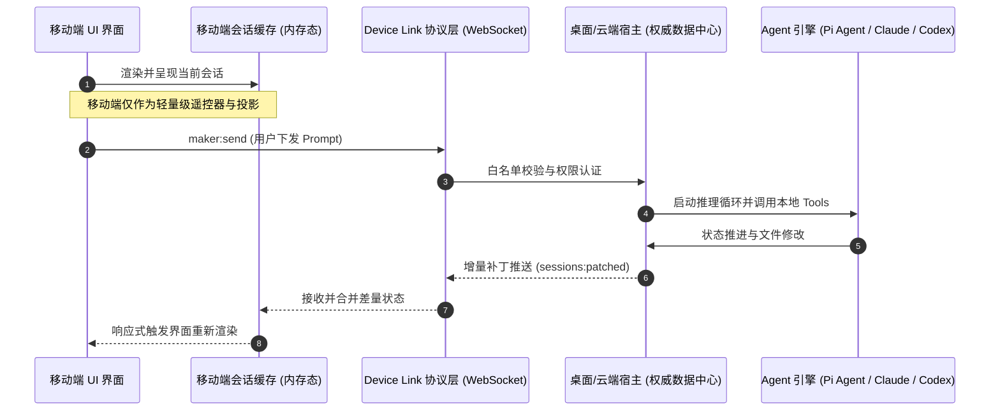

# 移动端本地运行时与端云协同架构深度调研报告

> 本文档基于对开源项目 **`OpenMinis/OpenMinis`** 与 **`makecindy/cindy`** 的源码级架构与 DeepWiki 一手资料（Primary Sources）考证，全面分析移动端原生 AI Agent 运行时的实现机制与端云协同设计。

---

## 1. 核心执行摘要

随着 AI Agent 从纯云端托管向端侧与边缘设备演进，移动端的系统架构分化为两种截然不同的范式：

1. **“极重端侧”本地运行时范式（以 `OpenMinis` 为代表）**：
   直接将大模型推理引擎与完整的 Linux 沙箱操作系统塞进手机应用中。核心逻辑是：**手机本身就是一台完整的计算机**，所有 Shell、Python 脚本与工具调用均在移动设备本地运行。
2. **“极轻协同”端云联动范式（以 `makecindy/cindy` 为代表）**：
   移动端应用彻底放弃重型计算，遵循“**零权威原则（Zero Authority）**”，只作为轻量级的交互控制器与状态投影窗口。真正的大脑（Agent Runtime）与手脚（Execution Sandbox）常驻于性能更强的桌面电脑或云端，通过专用低延迟协议跨设备通信。

本报告深入解构这两套截然不同的工程方案，并结合 Termux、WebAssembly 等边缘沙箱技术，为 **PowerI 的端云混合架构** 提供标准化的技术落地指引。

---

## 2. OpenMinis：“极重端侧”本地 Linux 沙箱架构剖析

[OpenMinis](https://github.com/OpenMinis/OpenMinis) 的核心突破在于：**在不依赖 Root 权限、完全遵守 Apple App Store 与 Google Play 安全审查规则的前提下，直接在 iOS 和 Android 内部完整内嵌了一个 Alpine Linux 沙箱环境**，使端侧 LLM Agent 拥有直接执行真实 CLI 工具和代码的能力。

### 2.1 系统整体架构

OpenMinis 在移动端划分为三个严格解耦的层级：

```mermaid
graph TD
    subgraph "UI 表现层 (SwiftUI / Jetpack Compose)"
        UI[聊天交互界面 / 会话视图]
    end

    subgraph "AI Agent 运行时层"
        VM[AIChatViewModel - 状态机调度]
        LLM[LLM Provider - 本地量化/远程模型]
        OFFLOAD[Native Offload - 原生旁路加速调度]
        SKILLS[Skills 体系与 MCP 扩展协议]
    end

    subgraph "Native 沙箱执行层"
        ISH[iOS: iSH 内核仿真 (ARM64 Asbestos 引擎)]
        PROOT[Android: PRoot 用户态系统调用拦截]
        ROOTFS[Alpine aarch64 极简根文件系统]
    end

    UI --> VM
    VM -->|Prompt 组装与推理| LLM
    LLM -->|ToolCall 工具决策| VM
    VM -->|Shell 指令派发| ISH
    VM -->|Shell 指令派发| PROOT
    ISH --> ROOTFS
    PROOT --> ROOTFS
    VM -.->|重型媒体任务拦截| OFFLOAD
```

### 2.2 移动端操作系统沙箱的具体实现

#### iOS 端：iSH 内核（ARM64 Fork 分支）
苹果 App Store 审核准则（App Store Review Guidelines）明文严禁应用在 Safari 之外动态生成或执行未经签名验证的机器码（即严苛的 W^X 内存安全限制，禁止 JIT 编译）。
* **仿真机制**：OpenMinis 引入了定制的 `OpenMinis/ish-arm64` 内核分支。标准的开源 iSH 项目主要模拟 x86 指令集，而 OpenMinis 的分支则直接仿真执行 `aarch64`（ARM64）指令。其核心采用了被称为 **Asbestos 引擎** 的“带线代码解释器（threaded-code interpreter）”，将 Linux 客户机的机器指令一对一映射到预先编译好的 C 函数调用（gadgets），完全不产生动态 JIT 代码，从而** 100% 合规通过苹果 App Store 审核**。
* **文件系统虚拟化**：利用基于 SQLite 的虚拟文件系统（`fakefs`），在 iOS 严格受限的沙盒沙箱路径下模拟出 POSIX 标准权限、软硬链接以及 UNIX 设备节点。
* **性能瓶颈**：由于所有指令均经由纯软件用户态解释执行，其纯 CPU 运算性能相比 iOS 原生 Native 代码存在 5~10 倍的性能衰减。

#### Android 端：PRoot 用户态系统调用拦截
与 iOS 相比，Android 的底层宿主本身就是一个 Linux 内核（跑在 ARM64 架构上），因此无需对 CPU 指令进行虚拟机层级的转译。
* **实现原理**：OpenMinis 采用了 **PRoot** 技术。它利用 Linux 标准的 `ptrace` 系统调用，在系统调用打到宿主内核之前，于用户态透明拦截并改写文件路径、UID/GID 权限，实现无需 Root 权限的虚拟 `chroot` 与 `mount --bind`。
* **执行性能**：通过一个常驻的 `PersistentShell` 实例调度执行 `/bin/sh`。由于执行的是原生编译的 `arm64` ELF 二进制文件，执行效率远高于 iOS 的 iSH 解释器，主要的性能损耗仅仅来自于 `ptrace` 的上下文切换开销。

### 2.3 Agent 运行时与关键创新：Native Offload（原生旁路加速）

Agent 运行时由 `AIChatViewModel` 统一管理，向 LLM 暴露 `shell_execute`、`file_write` 等基础工具。

* **Native Offload（原生能力旁路加速）**：
  由于在 iSH/PRoot 沙箱内执行重型任务（如使用 `ffmpeg` 剪辑视频、处理大型音频）极其缓慢，OpenMinis 设计了一套创新的旁路拦截机制。当 LLM 派发特定的重型命令时，沙箱内核层在 `execve()` 阶段捕获该命令，**不再交由低速沙箱执行，而是将指令序列化为 JSON 发送给宿主原生 Swift/Kotlin 层**，直接调用苹果的 VideoToolbox 或 Android 的 MediaCodec 硬件加速管线，执行完毕后再将文件和结果回传至沙箱，兼顾了 Linux CLI 的通用性与移动端硬件加速性能。
* **`minis://` 跨域统一协议**：
  设计了统一的 URL 抽象，打通沙箱本地路径、系统临时附件以及多会话存储，屏蔽底层物理路径的差异。

### 2.4 性能现实与移动端物理限制
* **真实支持度**：在手机内部可以直接执行 Python 3、Node.js（通过 Alpine 的 apk 软件仓库安装）和标准 Shell 脚本。
* **冷启动延迟**：初次启动解压 Alpine minirootfs 压缩包需要耗费数秒时间。
* **内存与防杀屏障**：必须配置严苛的缓冲策略（例如强制截断 100KB 以上的标准输出），防止终端产生海量日志直接触发移动端操作系统的 OOM 机制强杀；同时对单次命令执行设定硬性超时阈值（如 10 分钟）。

---

## 3. makecindy/cindy：“极轻端云协同”架构剖析

与 OpenMinis 的“单机硬抗”思路相反，[makecindy/cindy](https://github.com/makecindy/cindy) 采取了高度工业化的多端协同路线。它的移动端应用完全不跑任何沉重的执行环境，而是一个精致的“远程控制中心（Controller）”，通过低延迟通信链路挂载到桌面端（Desktop）或云端 Host 上。

### 3.1 多设备协同体系与“零权威”原则

Cindy 在移动端推行彻底的 **“零权威原则（Zero Authority Principle）”**：移动端不作为任何状态的最终裁决者。



### 3.2 Device Link 协议（设备联动协议）
为了在极度不稳定的移动蜂窝网络（4G/5G 切换、进电梯、弱网）下保持高度可靠的连接，Device Link 协议设计了严密的保障机制：
* **严格的调用白名单（`REMOTE_INVOKE_ALLOWLIST`）**：严格限制移动端能够向远端 Host 发起的指令范围（如仅允许 `maker:create-session`、`maker:send` 等高阶业务指令，杜绝直接暴露任意底层系统调用）。
* **有序确认机制（Sequence ACK）**：重型状态数据帧携带自增序列号，如果手机端丢包，状态机能精准定位断点并请求重发。
* **动态 Agent 发现**：移动端在初次连接时通过 `maker.listAvailableAgents()` 探测宿主机当前安装了哪些引擎，据此动态开关界面功能。

### 3.3 远程会话存储（Remote Session Store）
* **零持久化内存投影**：移动客户端坚决不把远程拉取的会话持久化到本地 SQLite 数据库中，只维护一个按 `deviceId` 分片的纯内存投影。
* **Anti-Entropy（抗熵增一致性调和算法）**：手机接入时先获取完整快照（`local-db:sessions:list`），随后监听远端广播的增量差量包（`sessions:patched`）。后台运行轻量级调和器定期纠偏，即使因网络闪断丢失了中间过程的推流帧，手机端界面也能在极短时间内对齐至远端的真实状态。

### 3.4 原生支持 Pi Agent 的多引擎架构
Cindy 在桌面端实现了多 Agent 抽象层，其中对 **Pi Agent** 进行了原生级别的封装集成：
* **Pi Agent**：直接调用宿主本地安装的 `pi` 二进制可执行文件，通过 `--mode rpc` 标准协议驱动，并在宿主机本地无缝打通 MCP（Model Context Protocol）扩展生态。
* **Claude Code 与 Codex**：分别通过独立守护进程（`cc-mgr`）与字节流代理实现双向通道接入。

---

## 4. 移动端/边缘端沙箱技术全景对比矩阵

| 方案 / 项目 | 适配平台 | 核心执行机制 | 真实能力边界 | 适用场景与评价 |
|---|---|---|---|---|
| **OpenMinis** | iOS / Android | iSH ARM64 解释仿真 (iOS) + PRoot 系统调用拦截 (Android) | 完整 Linux 环境，支持 Alpine 常用工具包、Python 3、Node.js，带 Native 加速 | **高（离线移动 Agent）**。目前业界在移动端跑本地真实 Linux 环境的最成熟工程范例。 |
| **Termux** | Android | 基于原生 Linux 用户态环境 + `PRoot` 容器 | 极其完善的原生编译运行环境，拥有成熟庞大的生态 | **高（仅限 Android）**。性能极佳，但易被 Android 12+ 的 Phantom Process Killer 机制在后台强杀。 |
| **iSH / a-Shell** | iOS | x86 用户态仿真 (iSH) / WebAssembly 虚拟机 (a-Shell) | 仅限于运行轻量脚本或预先编译好的 WASM 二进制模块 | **中等**。iSH 原生版本性能过慢；a-Shell 缺乏进程派生与动态原生编译能力。 |
| **Runno / WASM** | 跨平台 (Web/移动浏览器) | V8 引擎内嵌的 WebAssembly 沙箱 | 仅支持纯粹的代码求值，缺乏原生文件系统、网络 Socket 及多进程能力 | **中等**。适合简单的数据计算与逻辑判断，无法作为通用 Agent 执行复杂系统任务。 |

---

## 5. 对 PowerI“端云混合架构”的战略借鉴与工程落地指引

结合 `OpenMinis` 与 `makecindy/cindy` 的核心成果，对于 PowerI 走向全平台（Desktop + Web + Mobile）的多端架构，我们得出以下关键工程结论：

### 5.1 核心策略：确立“分级沙箱（Tiered Sandbox）”架构
彻底放弃“要么全本地、要么全云端”的非黑即白思维，采用分级解耦设计：

1. **第一级：端侧轻沙箱（Tier 1 - Mobile Light Sandbox）**
   * **借鉴 OpenMinis**：在移动端嵌入轻量化的 Alpine PRoot (Android) 或 WebAssembly 执行引擎；
   * **职责范围**：仅处理本地小文件读写、数据清洗、文本排版，以及通过 Native 接口调用手机端原生能力（读取剪贴板、日历、本地提醒）；
   * **优势**：保证手机在离线、无网环境下依然具备轻量 Agent 处理能力。
2. **第二级：云端/桌面重沙箱（Tier 2 - Cloud/Desktop Heavy Sandbox）**
   * **借鉴 Cindy + 旧版 PowerI**：一旦 Agent 判定当前任务需要进行重型依赖安装（`npm install`、`pip install`）、Docker 容器编排、大型代码编译或涉及复杂文件树的读写；
   * **升阶机制（Escalation）**：任务自动交接给云端 Gateway 调度的轻量容器（或联动的工位 PC），手机端断开连接不影响任务持续运行。

### 5.2 状态同步：借鉴 Cindy 的 Device Link 漫游设计
PowerI 移动端应采纳 Cindy 的 **Remote Session Store（抗熵增内存投影）** 设计：
* **手机发起，云端长跑**：用户在手机上用语音发送“梳理当前仓库分支并跑完整构建”，手机应用只发送轻量 Action，随后用户直接锁屏；云端沙箱默默完成重型构建，构建完成后通过系统通知（Push Notification）唤醒手机。
* **多端状态漫游（Handover）**：工位打开 PowerI Desktop 桌面应用，基于 `sessions:patched` 增量协议即时拉齐最新执行状态，实现“路上手机看进展，到工位电脑直接编码”的无缝闭环。

---

## 6. 总结

移动端 AI Agent 的未来绝不是强行把所有重型算力都硬塞进手机发烫的芯片中。
* **OpenMinis** 的核心启示在于：**利用 Native Offload（原生旁路）与用户态轻沙箱，可以在完全合规的前提下为手机赋予底层的 Linux 工具执行能力**；
* **makecindy/cindy** 的核心启示在于：**利用 Device Link 协议与零权威内存投影，可以构建极度优雅可靠的端云协同长任务接管体验**。

两者结合，正是 PowerI 迈向“**桌面端可离线开发、Web 端可企业协作、移动端可随时漫游**”端云一体终局的最优路径。