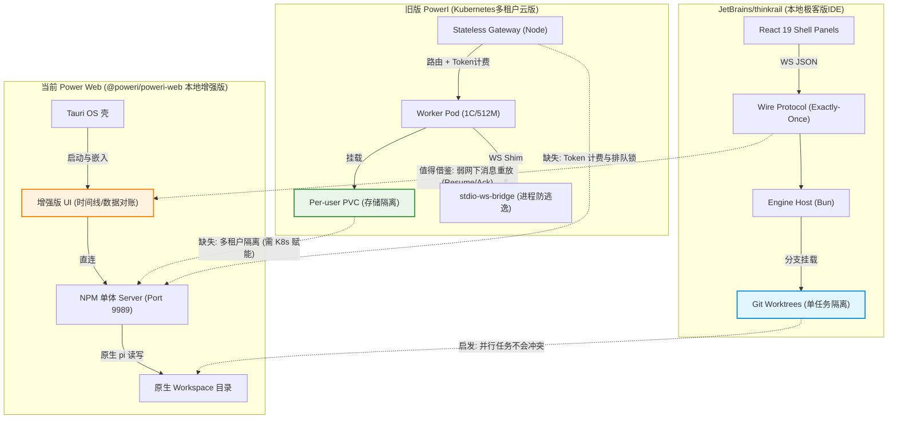

# ThinkRail、旧版 PowerI 与当前 Power Web 源码与架构深度复盘

本文档基于对 `JetBrains/thinkrail`、旧版 PowerI (`/Users/tianzhao/code/leoao/poweri`) 的核心源码及 ADR 的深度调查，对三者的架构演进与设计权衡进行详细比对。

## 1. JetBrains/thinkrail 的源码与架构深挖

ThinkRail 的核心定位是“强分支隔离的高级本地 Agent IDE”，其底层架构极其重视模块边界和任务并行时的文件系统一致性。

### 1.1 三环架构 (Three-Ring Architecture)
ThinkRail 在 Node (Bun) 单体环境中实现了严格的三层解耦（依赖方向从外向内）：
1. **Engine Host (`packages/server`)**:
   - **进程宿主与生命周期**：运行在 Bun in-process 中，通过 `AgentSessionManager` 管理各个 tab 下的 `pi` Agent 进程。
   - **Request-Replay 幂等缓存**：为了应对 Tailscale 或移动网络断连，Host 使用 `(clientKey, requestId)` 为键的 `RequestReplayCache`。客户端重连时通过 `resume` 帧声明未完成请求，Host 命中缓存则下发拦截结果，直至收到 `ack` 才会丢弃缓存（Exact-Once 语义）。
   - **动态运行时装载 (PiRuntimeGeneration)**：无缝加载 `pi-*` 系列扩展，无需重启进程。
2. **The Wire Protocol (`packages/contracts`)**:
   - 作为 Types-only 协议层，定义了 `WS_METHODS` (双向 RPC) 和 `WS_CHANNELS` (单向推送)。
   - 对 `pi` 协议底层 SDK 进行了瘦身镜像 (如 `WireModel`，移除密钥信息)，确保 UI 不耦合厚重的 Node SDK。
3. **UI Client (`apps/web`)**:
   - 基于 React 19 + Zustand。
   - 实现“壳与面板 (Shell & Panels)”的布局同步，利用 `baseRevision` 与 Host 进行乐观状态 (Optimistic Commit) 调和与冲突处理。

### 1.2 Git Worktree 工作区与沙箱机制
- **Git Worktree 并发隔离**：这也是 ThinkRail 最关键的设计。传统工具在同一目录执行多任务会遭遇状态冲突，ThinkRail 利用 `git worktree`，将每个新会话/Task 开辟到独立的工作树（挂载在 `~/.thinkrail/worktrees` 下的孤立分支）。多个 Agent 并发读写互不干涉。
- **终端管理 (`bun-pty`)**：将 Web 中的 `xterm.js` 对接到后端的原生 PTY。但终端与 `(workspaceId, tabKey)` 强绑定，受到 host 限制。

### 1.3 核心 Pi 扩展生态机制
- **`pi-thinkrail-workflow`**: 注入全局的 root router skill，利用 `ask_user_question` 规范化人机交互决策树。
- **`pi-spec-graph`**: 需求图谱管理。暴露 `spec_*` 读写工具，结合前端专有 Panel 渲染 Spec 引用链路。
- **`pi-todos`**: 提供一套任务状态机的 Wire DTO，使得 Agent 制定的 Todo 计划能在 UI 呈现为可交互的节点列表。

### 1.4 局限与安全性缺陷
- **非多租户架构**：Host 完全假设环境为单用户可信，**无法直接搬运到云端对外提供多租户 SaaS 服务**。
- **沙箱隔离缺失**：Agent 执行代码、访问文件时，直接共享 Host 的 OS 权限。这在本地开发无虞，但在公有云中是极高的安全逃逸风险（缺乏 Cgroups / User Namespaces 隔离）。

---

## 2. 旧版 PowerI (Kubernetes 版) 源码与 ADR 复盘

位于 `~/code/leoao/poweri` 的旧版 PowerI 针对的场景与 ThinkRail 截然不同：它的第一要素是**大规模多租户云环境下的物理隔离与路由**。

### 2.1 核心模块层设计 (ADR 推导)
- **ADR-0001: Per-user PVC (租户存储硬隔离)**
  - 弃用共享目录和 S3，直接为每个用户在 K8s 动态申请 PVC 并挂载。根绝了目录权限渗透导致的租户数据串接。
- **ADR-0002: stdio-websocket-bridge (RPC 隧道协议)**
  - 位于 `worker/bridge/server.mjs`。由于 `pi` cli 本质是 stdio 交互，旧版本在 Worker 容器里注入了一个 WebSocket Shim，将 `pi --mode rpc` 的 stdin/stdout 包装成 WS 流暴露给 Gateway，保留了完全的进程级沙箱。
- **ADR-0003 & 0004: 无状态网关与温池调度 (Gateway & Warm-pool Pods)**
  - `gateway/server.mjs`：利用 `Authorization: Bearer` 解析用户，动态查找并代理转发。
  - 请求打到网关后，若该用户无活动 Pod，则向 K8s API 动态发送 `Deployment+PVC+Service` 编排。空闲超时 (`IDLE_MIN=30`) 后缩容到 0 (保留 PVC)，下次请求自动拉起。这不仅实现了严格算力边界（如限制 Cpus = 1，Mem = 512MB，ADR-0008），且极大降低了闲置云成本。
- **ADR-0005: 会话串行保护机制**
  - 利用本地（或分布式 Redis）锁 (`queue.mjs - withLock`)：确保单用户、单 `sessionId` 在同一时刻只放行一个 in-flight 请求。防止多个请求并发覆盖同一会话的 JSONL 造成死锁和乱序。跨 Session 可并行。

### 2.2 附加云上特性：Metering
- 网关通过拦截 SSE (Server-Sent Events) 中的 `message_end`，累加 `usage` 数据，写入元数据，实现了细粒度 Token 计费和平台级洞察 (`gateway/metering.mjs`)。

---

## 3. 当前 Power Web (`@poweri/poweri-web`) 与三者的交叉比对

当前 Power Web 是基于上游原生 `pi-web` 增强分支演进而来的 NPM 分发物（基于端口 `9989`），主要承载本地桌面 Tauri APP 的前端呈现。

### 3.1 优势 (对比两者)
- **极强的 UI/UX 与垂直体验**：相较于裸奔 CLI，拥有时间线回溯、数据对账视图及完善的多分支视觉导航。
- **单体极简部署**：一键 Tauri 安装环境（Node + 离线包），免去复杂的 K8s 部署或 Bun 编译，非常适合个人开发者 ToC 下放。

### 3.2 局限与痛点
1. **缺乏 ThinkRail 的 Worktree 安全并发能力**：现版 Power Web 的多分支任务仍然依赖原生 `pi` 的目录直接操作。如果多个 Agent 会话操作同一仓库，容易产生文件锁甚至互相 Git Reset，做不到 ThinkRail 级别物理工作树分支的纯净并行。
2. **缺乏旧版 PowerI 的多租户算力/存储隔离**：现版本退化回了本地模型，如果想平移回云端暴露，其后端与前端是高强度直连单机系统的，缺乏租户 Token 验证、Pod 算力隔离和计费流。

---

## 4. 架构演进与能力映射全景图

### 总结
1. **云端 SaaS 回归路线**：如果未来 Power Web 需要回流公有云 SaaS，必须捡回 **旧版 PowerI 的 K8s Pod 沙箱 + Per-user PVC** 设计。
2. **本地并发极致化路线**：如果未来 Power Web 想解决本地多任务导致的 Git 冲突锁死，必须借鉴 **ThinkRail 的 Git Worktree 物理分支隔离** 的设计。
3. **弱网终端可用性**：ThinkRail 提出的 **RequestReplayCache (Resume/Ack)** 能够极好地补充云上服务时的 Socket 漂移问题。
